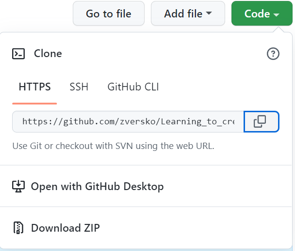

## 12. Инструкция по созданию pull request

### Для примера попробуем поработать с готовым репозиторием и внести в нем изменения.

Заходим в интересующий нас репозиторий на Github нажимаем на зеленую кнопку "Code" где копируем URL ссылку на нужный нам репозиторий.



Создаем необходимую папку для клонирования репозитория, заходим в эту папку.

```
    mkdir <название_папки>
    cd <название_папки>
```

Затем выполняем команду в терминале (или командной строке Windows):

```
    git clone <вставляем_URL>
```

Ветка по умолчанию — master(или main). Чтобы изменениями было проще управлять и они не смешивались друг с другом, создадим отдельную ветку, где и будем работать. При этом ветку стоит назвать так, чтобы имя говорило о её назначении.

```
    git checkout -b new-feature
```

Теперь приступаем к работе. Редактируем код, обновляем документацию. Эти изменения мы коммитим в нашу ветку.

```
    git add <имя файла>
    git commit -m 'Add some code'
```

После чего мы осуществляем отправку ветки обратно на GitHub

```
    git push
```

После чего заходим на github и нажимаем кнопку pull request